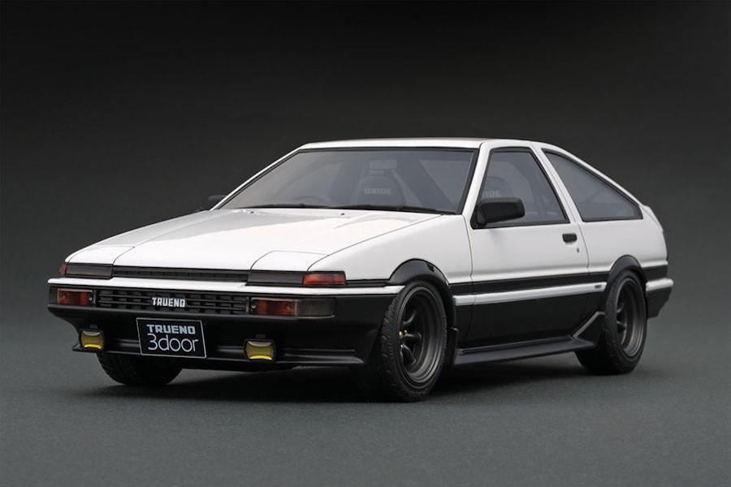
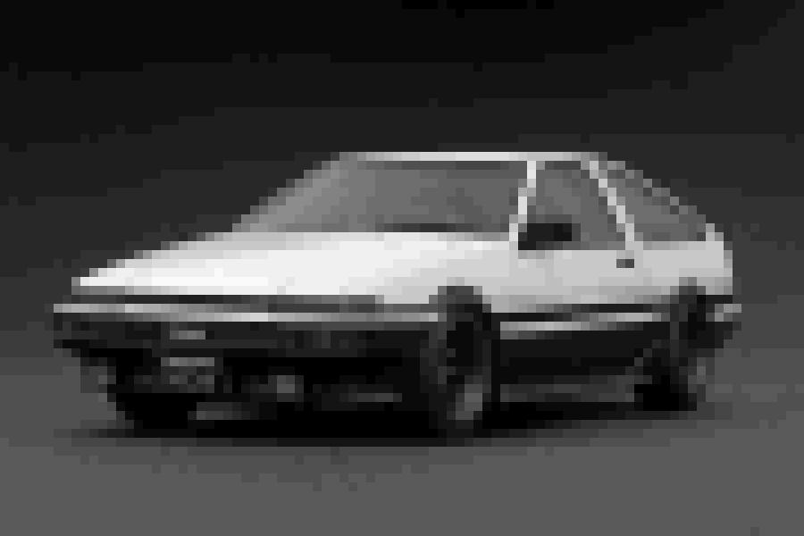
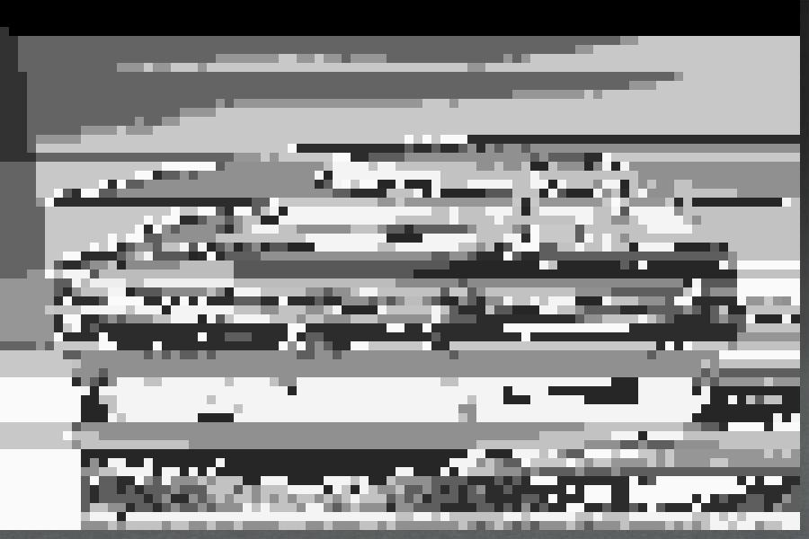
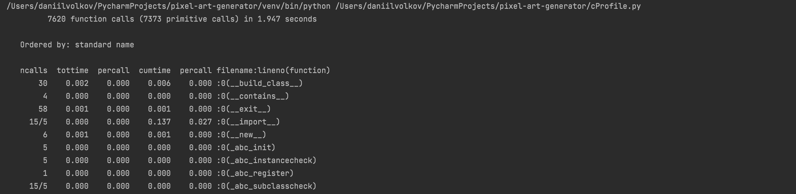
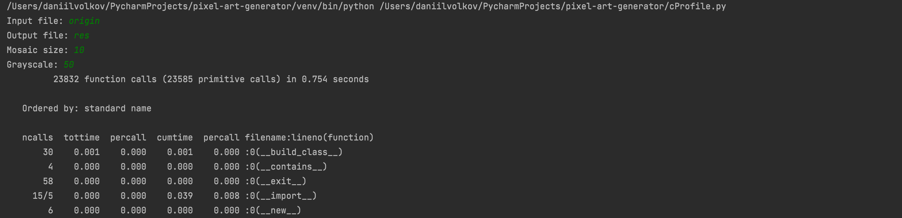
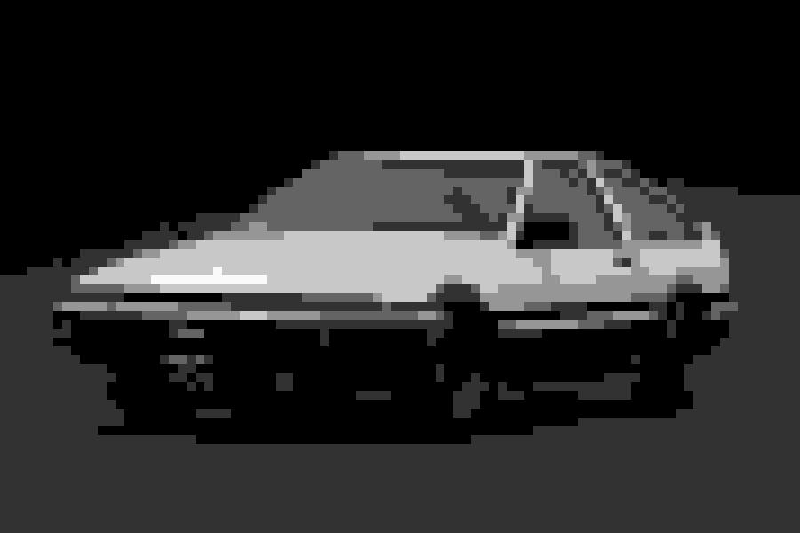

Pixel Art Generator
==

Профилирование:
--

* old_filter.py    

>Время выполнения - 1.947 сек

---
* filter.py       

>Время выполнения - 0.754 сек

---
* filter_with_filename.py

>Время выполнения - 0.464 сек

